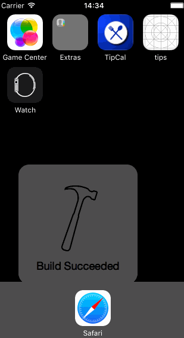

# codepath
Tip Calculator in Swift
Submitted by: Jasmine Farrell

Time spent: 14 hours spent in total

## User Stories

This was one of the more challenging projects I've had to do in a long time.As a full-time student, one of the main challenges
I’ve encountered while teaching myself Xcode & swift is finding the time to fit it into my already hectic schedule. 
Luckily, after researching lots of different strategies on how to manage my time,
I’ve found a better balance between all of the commitments in my life. 
Programming is fundamentally about creating  solutions to problems. At the end of the day, creating something that didn’t exist that morning, is all the satisfaction one needs. 
And creating solutions to your own personal life is a great example of the commitment one must make to see the growth of your skills in programming. 

The following **required** functionality is complete:

* [x] User can enter a bill amount, choose a tip percentage, and see the tip and total values.
* [x] Settings page to change the default tip percentage.

The following **optional** features are implemented:
* [x] UI animations
* [] Remembering the bill amount across app restarts (if <10mins)
* [x] Using locale-specific currency and currency thousands separators.
* [x] Making sure the keyboard is always visible and the bill amount is always the first responder. This way the user doesn't have to tap anywhere to use this app. Just launch the app and start typing.

The following **additional** features are implemented:

- [x] List anything else that you can get done to improve the app functionality!
The slider bar was implemented as the secondary screen instead of the segmented bar.

## Video Walkthrough 

Here's a walkthrough of implemented user stories:

GIF created with [LiceCap](http://www.cockos.com/licecap/).

## Notes

Describe any challenges encountered while building the app.

1. Challenge: Settings Bar - This was the beginning of many of the challenges I would encounter. I found placing the 
item label wouldn't settle in the corner, that is until I used the navigation controller first, placing it underneath the BarButtonItem. 

2. Challenge: Loading and saving - Passing data between the settings screen and viewcontroller took me nearly 
8 hours to figure out. The code that was provided in the pre-work was extremely helpful in solving this problem especially,
viewWillAppear, viewDidAppear and  print("view will appear"). Ultimately the NSUserDefaults was the best method to complete this
portion of the challenge. 

3. Challenge: Slider bar was killer not the customization of the slider’s appearance or the slider's control but passing the value
tip percentage as the new value for the calculator. This required creating a “if then else” conditional statement for the segmented controller "other" option 
to be called in lieu of the default tip percentages.

## License

    Copyright [2015] [Jasmine Farrell]

    Licensed under the Apache License, Version 2.0 (the "License");
    you may not use this file except in compliance with the License.
    You may obtain a copy of the License at

        http://www.apache.org/licenses/LICENSE-2.0

    Unless required by applicable law or agreed to in writing, software
    distributed under the License is distributed on an "AS IS" BASIS,
    WITHOUT WARRANTIES OR CONDITIONS OF ANY KIND, either express or implied.
    See the License for the specific language governing permissions and
    limitations under the License.
